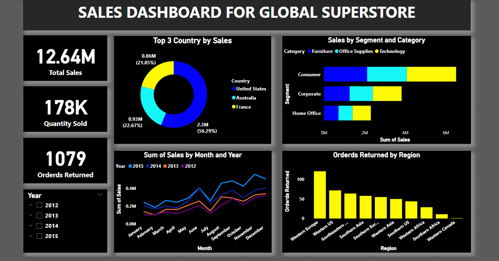

# 📊 Sales Dashboard for Global Superstore

## 🧾 Project Overview

This interactive Power BI dashboard provides insights into global superstore sales performance over multiple years. The dashboard is designed to enable quick, data-driven decisions by visualizing KPIs, trends, and segmentation analysis.

---

## 📌 Key Features

- **💰 Total Sales**: 12.64 Million in total revenue.
- **📦 Quantity Sold**: Over 178,000 units.
- **↩️ Orders Returned**: 1,079 returned orders tracked.
- **🌍 Top Countries by Sales**:
  - United States (56.29%)
  - Australia (22.67%)
  - France (21.05%)
- **📈 Sales Trends by Month & Year**: Multi-line chart showing sales trends across 2012 to 2015.
- **👥 Sales by Segment and Category**: Bar chart breakdown by Consumer, Corporate, and Home Office segments.
- **📦 Orders Returned by Region**: Highlights regional return volumes.

---

## 📂 Data Used

The dashboard is based on the **Global Superstore dataset**, which includes:
- Sales data
- Customer segments
- Product categories
- Regional and country-level data
- Returned order tracking

---

## 🧠 Insights Extracted

- The **Consumer segment** dominates sales, especially in the **Technology** category.
- The **United States** is the highest revenue-generating country.
- **Western Europe** has the highest number of returned orders.
- Sales peak around **October–December** each year.

---

## 🛠 Tools Used

- **Power BI**
- DAX for custom calculations and metrics
- Data cleaning in Power Query

---

## 🚀 How to Use

1. Open the `.pbix` file in Power BI Desktop.
2. Interact with slicers and filters to explore trends by year, category, and segment.
3. Use the report to make decisions on product focus, customer segments, and return reduction strategies.

---

## 📬 Contact

For any queries or collaborations, feel free to reach out via [LinkedIn](https://www.linkedin.com/in/naveen-kumar-lebaka-868284267) or [email](mailto:naveenlebaka.9082@gmail.com).

---
